# DNS-Server

## Intro

This project outlines the implementation of how DNS works.

## Tech used

### Operating Systems

- Windows Server 2022
- Windows 10

### Platform and Software

- Remote Desktop Connection
- DNS Manager
- Command Prompt

## Overview

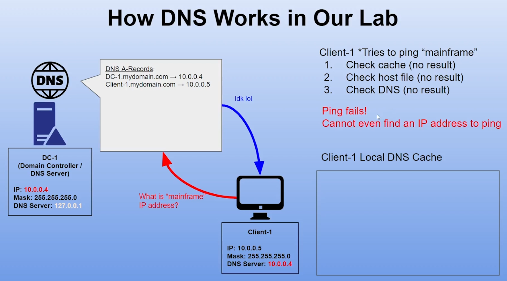
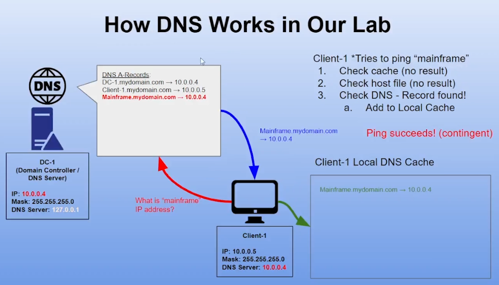

## Configuration Steps
###### top
- [Section 1: A-Record](#section-1-a-record)
- [Section 2: Local DNS Cache](#section-2-local-dns-cache)
- [Section 3: CNAME](#section-3-cname)
- [Bonus Section: Root Hints](#bonus-section-root-hints)

### Section 1: A-Record

Create A-Record

- Log into DC-1 -> Server Manager -> Tools -> DNS -> Forward Lookup Zone -> mydomain.com -> right click black space -> ***New Host (A or AAAA)*** -> Name -> type mainframe -> IP Address -> 10.0.0.4 -> Add Host 
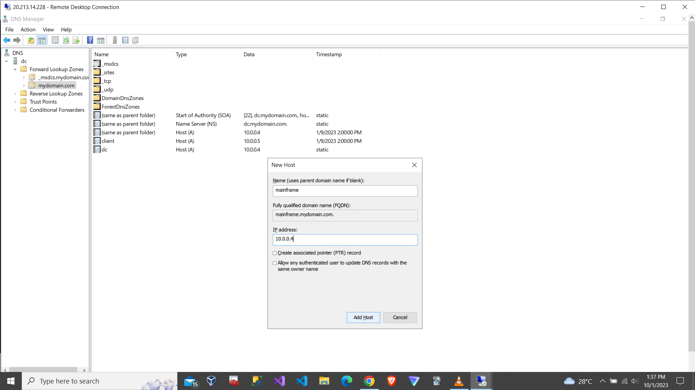

Ping "mainframe" and check status

- Log into Client-1 -> open command prompt as administrator -> type ping mainframe -> type nslookup mainframe / type ipconfig /displaydns
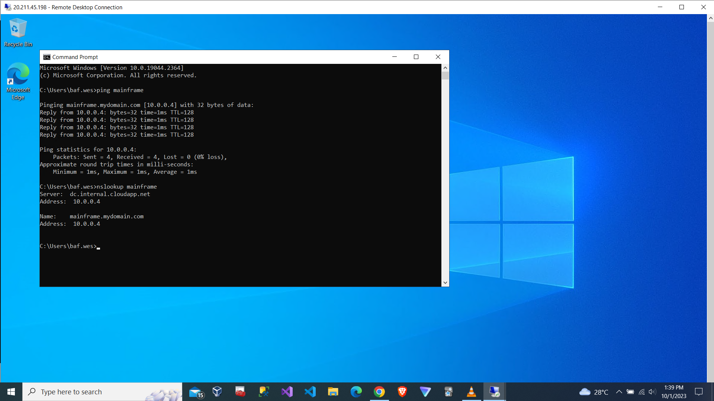

### Section 2: Local DNS Cache
[back to top](#top)

Change "mainframe" IP address

- Back to DC-1 -> double click "mainframe" -> IP Address -> type 8.8.8.8 -> OK
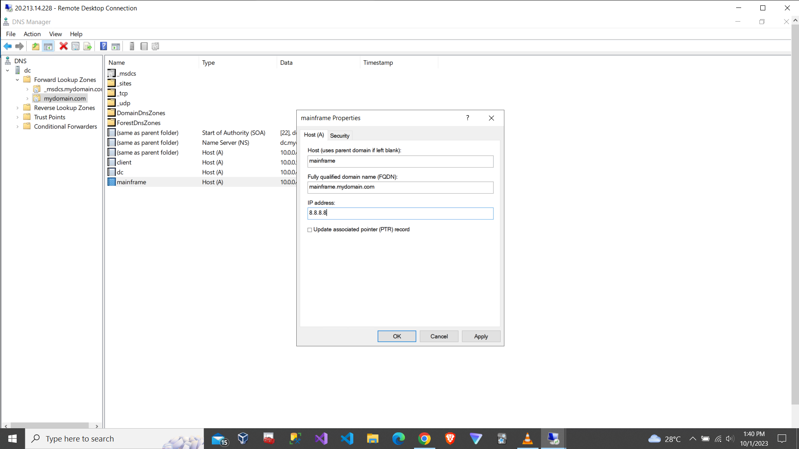

Ping "mainframe" and refresh the status

- Go to Client-1 -> ping "mainframe" -> still ***pinging the old IP address 10.0.0.4*** -> type ipconfig /flushdns -> ping "mainframe" again -> check status
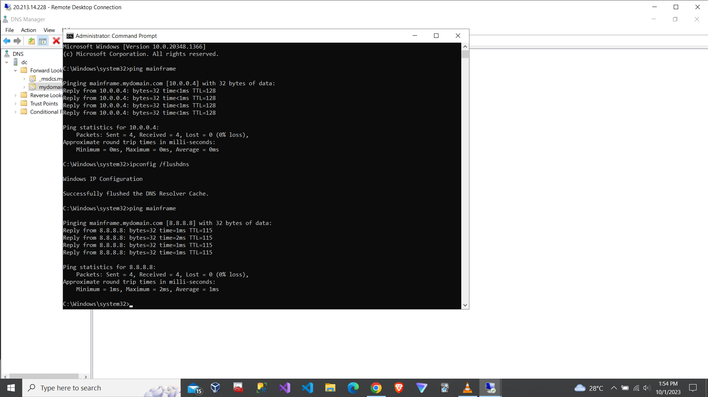
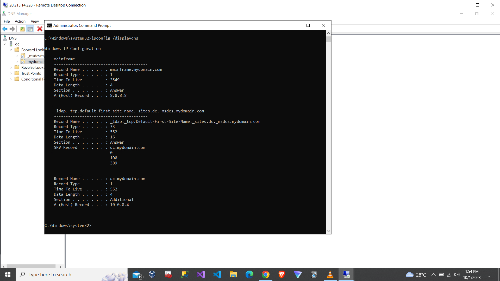

### Section 3: CNAME
[back to top](#top)

Ping "search"

- Continue in Client-1 / (ctrl+r -> type cmd) -> ping "search"
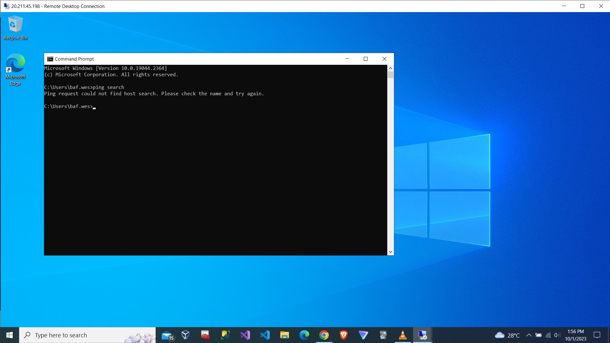

Create CNAME

- Back to DC-1 -> Server Manager -> Tools -> DNS -> Forward Lookup Zone -> mydomain.com -> right click black space -> ***New Alias (CNAME)*** -> Alias name (uses parent domain if left blank) -> type search -> Fully qualified domain name (FQDN) for target host -> www.google.com -> OK
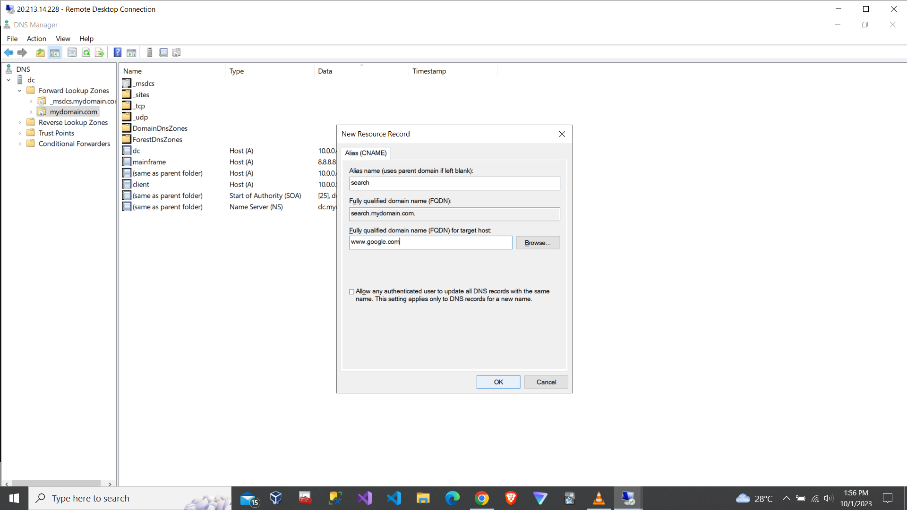

Ping "search" and check status

- Back to Client-1 -> ping "search" -> type ipconfig /displaydns
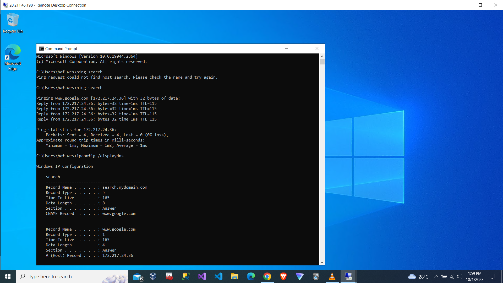

### Bonus Section: Root Hints
[back to top](#top)

- Since ***Client-1 is solely rely on DC-1*** to resolve all domain name queries but DC-1 only have 3 domain name (dc-1, mainframe, search)
- When you're browsing 1 website, check local DNS cache (Section 2) and there are ***bunch of random domains instead of your single website URL only***
- So behind the scene, that's what Root Hints come into place to resolve the issue
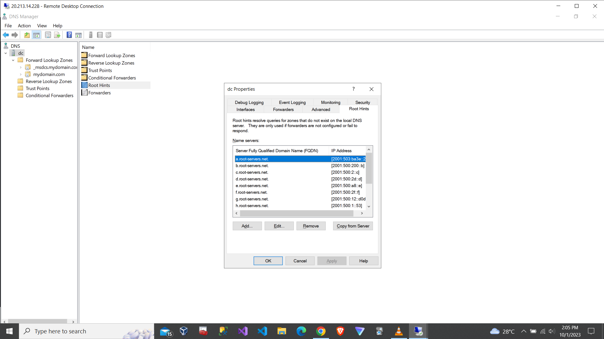

:warning:Last but not least, please don't forget to clean up your Azure resource groups as ***you can incur charges*** that use up your $200 free credits!

## Credits
[back to top](#top)

- [Josh Madakor](https://github.com/joshmadakor1)